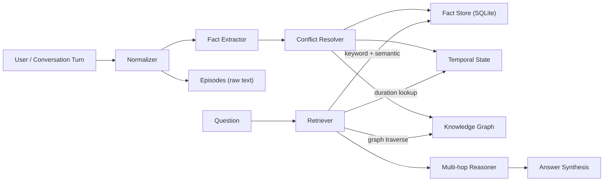
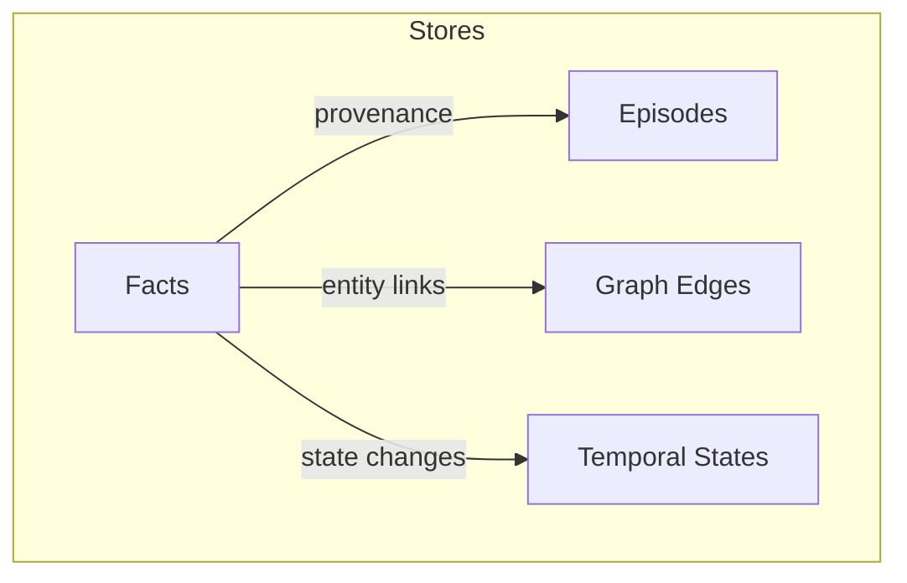
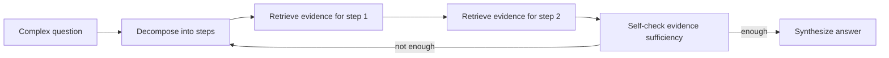

# LLM Memory — “real memory”, not chat history

**LLM Memory** is a local-first memory system for agents that stores *structured facts + provenance + temporal state* and retrieves them with multi-angle search and multi-hop reasoning. It’s built to be inspectable: you can **watch facts and the graph form in the UI** as you chat or as you replay benchmark conversations.

[](https://opensource.org/licenses/MIT)
[](https://www.python.org/downloads/)
[](https://ollama.com/)

---

## Visual tour (UI + architecture)


> Replace these SVGs with real screenshots later (same paths keep the README stable).

---

## Why this exists (the problem)

Most “agent memory” projects are either:
- **Chat history** (stuff more tokens into the prompt), or
- **Vector-only** (embed everything, hope similarity pulls the right snippet), or
- **Summaries** (overwrite details and lose provenance).

This repo takes a **facts-first** approach:
- Convert conversation into **structured, queryable facts** at ingest time (plus provenance).
- Track **temporal state** so “how long/since/ago” is computed, not guessed.
- Resolve **conflicts** so memory stays consistent over time.
- Retrieve with **multiple signals** (facts + graph + temporal + episodes).

---

## What you get

| Capability | What it does | Why it matters |
|---|---|---|
| **LLM-backed fact extraction** | Turns unstructured turns into granular facts (S–P–O + metadata). | Enables grounded answers + graph building. |
| **Conflict resolution** | Detects updates / contradictions and marks stale facts non-current. | Prevents “double beliefs”. |
| **Temporal state tracking** | Models “since/for/ago” and duration questions. | “How long?” becomes computable, not guessed. |
| **Multi-angle retrieval** | Keyword + graph traversal + temporal lookup (and more). | Recall stays high even with phrasing drift. |
| **Multi-hop reasoning** | Decomposes complex questions and iteratively retrieves. | Helps with questions requiring chaining. |
| **Inspectable UI** | Facts, graph, timeline panels update in real time. | Debugging becomes visual instead of vibe-based. |

---

## Core concepts (how memory is represented)

| Concept | Stored in | Purpose | Key fields |
|---|---|---|---|
| **Fact** | SQLite + in-memory indexes | Primary “knowledge” unit (atomic, queryable) | `subject`, `predicate`, `object`, `fact_type`, `is_current`, `source_date` |
| **Episode** | SQLite | Raw/provenance “what was said” | `speaker`, `original_text`, `normalized_text`, `date`, `fact_ids` |
| **Temporal State** | SQLite + tracker | Computable durations / “since/ago/for” | `state_type`, `start_date`, `duration_*`, `duration_text` |
| **Graph edge** | Derived from facts | Entity linking for graph traversal | `subject ↔ object` (via facts) |

---

## Quickstart

### 1) Install

**Requirements**
- Python **3.11+**
- [Ollama](https://ollama.com/) running locally

**Setup**

```bash
python -m venv venv
source venv/bin/activate
pip install -r requirements.txt
```

### 2) Run the Web UI (recommended)

```bash
python llm_memory/agents_v4/web_ui.py
```

Open `http://127.0.0.1:5000`.

### 3) Run the CLI agent

```bash
python run_agent.py
```

### 4) Stream LOCOMO conversations into the UI (watch memory form)

1) Start the UI (step 2)
2) In another terminal:

```bash
python run_benchmark_ui.py
```

This will clear memory and replay LOCOMO turns into `/api/chat` so you can watch **Facts/Graph/Timeline** evolve live.

---

## Entrypoints & ports (table)

| What | Script | Port | Notes |
|---|---|---:|---|
| **Agent Web UI** | `llm_memory/agents_v4/web_ui.py` | 5000 | Chat + Facts/Graph/Timeline |
| **Benchmark replay into UI** | `run_benchmark_ui.py` | (uses 5000) | Sends LOCOMO turns to `/api/chat` |
| **Benchmark Visualizer dashboard** | `benchmark_viz.py` | 5001 | Dedicated benchmark dashboard (graph + facts + temporal + reasoning) |
| **CLI agent** | `run_agent.py` | — | Interactive terminal chat |
| **Benchmark suite** | `python -m benchmarks.benchmark_memory ...` | — | Produces JSON + Markdown reports |
| **LOCOMO V4 benchmark** | `python benchmarks/locomo_v4.py ...` | — | Writes `benchmarks/reports/locomo_v4_*.json` |

---

## Architecture (Mermaid diagrams)

### End-to-end flow



### Data model (what gets stored)



### Multi-hop reasoning loop (high level)



---

## Benchmarks (two layers)

This repo has **two benchmarking tracks**:

1) **Benchmark Suite** (`benchmarks/benchmark_memory.py`)  
   - Measures: accuracy (EM/contains/F1), latency (p95), and composite scoring.
   - Produces: JSON + Markdown reports under `benchmarks/reports/`.

2) **LOCOMO V4 benchmark** (`benchmarks/locomo_v4.py`)  
   - Loads LOCOMO dataset from `benchmarks/locomo_data/data/locomo10.json`
   - Runs fact-based ingestion + retrieval + answer prompting per QA item.
   - Saves: `benchmarks/reports/locomo_v4_YYYYmmdd_HHMMSS.json`

This repo includes a benchmark suite under `benchmarks/` with a detailed guide:
- `benchmarks/README.md`

### Latest benchmark snapshot (from generated report)

The repo contains benchmark reports like:
- `benchmarks/reports/LLM-Memory (gemma3:27b)_20260121_154816.md`

Key numbers from that report:

| Scenario | Composite | F1 | Contains Match | Exact Match | P95 latency |
|---|---:|---:|---:|---:|---:|
| single_hop | 53.9 | 0.195 | 100.0% | 0.0% | 4798.4ms |
| multi_hop | 39.0 | 0.132 | 100.0% | 0.0% | 8982.2ms |
| temporal | 21.8 | 0.100 | 90.0% | 0.0% | 6247.1ms |
| conflict | 20.1 | 0.075 | 66.7% | 0.0% | 7851.6ms |

Overall composite score (same report): **33.7 / 100**.

### Run the benchmark suite

```bash
python -m benchmarks.benchmark_memory --quick
```

### Run LOCOMO V4 directly

```bash
python benchmarks/locomo_v4.py --model qwen2.5:32b
```

Example: only multi-hop (category 3), first 5 conversations, max 30 questions each:

```bash
python benchmarks/locomo_v4.py --model qwen2.5:32b --categories 3 --max-conv 5 --max-questions 30
```

For the full set of options (scenarios, samples, comparisons), see `benchmarks/README.md`.

---

## Model configuration

The UI/CLI currently default to `qwen2.5:32b` in:
- `llm_memory/agents_v4/web_ui.py`
- `run_agent.py`

If you want to switch models, update `model_name="..."` in those files (for example, `openthinker:32b` if you have it in Ollama).

---

## Implementation map (where to look in code)

### Memory V4 (facts-first CORE-style)

| Component | File | What it does |
|---|---|---|
| **Orchestrator** | `llm_memory/memory_v4/memory_store.py` | Ingest pipeline + persistence + context builder |
| **Normalizer** | `llm_memory/memory_v4/normalizer.py` | Cleans text, resolves pronouns, standardizes terms |
| **Fact extractor** | `llm_memory/memory_v4/llm_extractor.py` | LLM JSON extraction + rule fallback + merge |
| **Conflict resolver** | `llm_memory/memory_v4/conflict_resolver.py` | Marks stale facts, logs resolutions |
| **Temporal tracker** | `llm_memory/memory_v4/temporal_state.py` | Parses since/for/ago into computable temporal states |
| **Retriever** | `llm_memory/memory_v4/retrieval.py` | Keyword/semantic/graph/temporal retrieval + episode search |
| **Multi-hop reasoner** | `llm_memory/memory_v4/multi_hop.py` | Decompose → retrieve iteratively → build reasoning context |
| **Advanced retrieval** | `llm_memory/memory_v4/advanced_retrieval.py` | Query expansion + HyDE generation used by V4 |

### Agent + UI

| Component | File | Notes |
|---|---|---|
| **LangGraph agent** | `llm_memory/agents_v4/graph.py` | Loads memory context before every response (uses `thread_id` checkpoints) |
| **UI** | `llm_memory/agents_v4/web_ui.py` | Flask UI, facts/graph/timeline panels |
| **Benchmark visualizer** | `benchmark_viz.py` | Separate dashboard focused on live benchmark internals |

---

## Repo map

```text
llm_memory/
  agents_v4/              # LangGraph agent + Flask UI
  memory_v4/              # V4 memory system (facts/temporal/retrieval/multi-hop)
benchmarks/               # Benchmark suite + LOCOMO data + reports
run_agent.py              # Interactive CLI runner
run_benchmark_ui.py        # Replays LOCOMO into the Web UI
```

---

## Troubleshooting (common issues)

| Symptom | Cause | Fix |
|---|---|---|
| `model 'X' not found (404)` | Ollama model not pulled | `ollama pull <model>` then retry |
| Mermaid “Unable to render rich display” | GitHub Mermaid syntax/labels | Use quoted labels and simple node shapes (this README does) |
| `fatal: pathspec 'docs/assets' did not match any files` | You’re copying from Cursor worktree but committing Desktop repo | `mkdir -p docs/assets` then copy files (see earlier commands) |
| Lots of `__pycache__` / `.db` changes | Runtime artifacts in working tree | Don’t add them; update `.gitignore` if needed |

---

## Testing

```bash
pytest -q
```

---

## License

MIT — see `LICENSE`.
