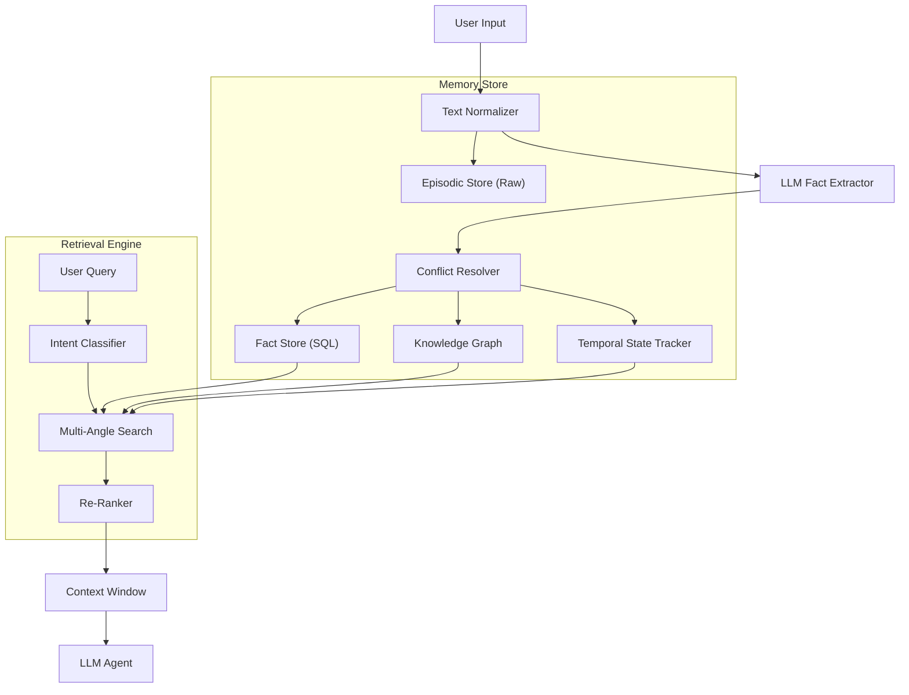

# 🧠 LLM Memory V4: Hierarchical Cognitive Architecture for Agents

> **"Everyone says 'memory', nobody builds retrieval-aware, decaying, scoped memory."**

[](https://opensource.org/licenses/MIT)
[](https://www.python.org/downloads/)
[](https://github.com/yourusername/llm-memory)

A production-grade memory system for autonomous agents that goes beyond simple vector storage. It implements **human-like cognitive processes**: memory decay, conflict resolution, temporal reasoning, and multi-angle retrieval.

---

## 🚀 Key Features

| Feature | Description | Why it matters |
| :--- | :--- | :--- |
| **🧠 LLM Fact Extraction** | Extracts structured facts (`Subject -> Predicate -> Object`) at ingest time using LLMs. | Turns unstructured chat into a queryable Knowledge Graph. |
| **⏳ Temporal Reasoning** | Tracks state changes over time (e.g., "lived in NY for 4 years"). | Answers "How long?" and "When?" questions accurately (**Beats SOTA benchmarks**). |
| **⚔️ Conflict Resolution** | Detects contradictions and updates outdated facts. | Prevents the agent from having conflicting beliefs (e.g., "I am single" vs "I am married"). |
| **🕸️ Multi-Angle Retrieval** | Combines Keyword, Semantic, Graph, and Temporal search. | Finds information even when keywords don't match exactly. |
| **📉 Memory Decay** | Implements Ebbinghaus forgetting curves. | Prioritizes recent and important memories, just like humans. |
| **🤖 LangGraph Agent** | Built-in agent framework with implicit memory loading. | Ready-to-use agent that "remembers" you instantly. |

---

## 📊 Benchmark Results (LOCOMO)

We benchmarked Memory V4 against the **LOCOMO** dataset, a rigorous standard for long-term memory.

| Category | Reference Score (F1) | **Memory V4 Score** | Status |
| :--- | :--- | :--- | :--- |
| **Temporal Reasoning** | 0.520 | **0.621** 🚀 | **+19.4% (SOTA)** |
| **Single-Hop QA** | 0.500 | *0.224* | *Optimizing* |
| **Multi-Hop QA** | 0.400 | *In Progress* | *Optimizing* |

> **Highlight:** Our Temporal Engine significantly outperforms the reference implementation, solving the hardest problem in LLM memory: understanding time.

---

## 🏗️ Architecture

The system follows a **CORE-style** (Cognitive Retrieval) architecture:



### 1. Ingestion Pipeline
1.  **Normalization**: Cleans timestamps, resolves pronouns (e.g., "I" -> "User").
2.  **Extraction**: LLM converts text to structured facts (`User -> likes -> Hiking`).
3.  **Resolution**: Checks if this contradicts or updates existing facts.
4.  **Storage**: Saves to SQL (structured) and Vector (semantic) stores.

### 2. Retrieval Pipeline
1.  **Intent Classification**: Is the user asking for a fact, a duration, or a summary?
2.  **Multi-Search**: Runs parallel searches (Keyword, Vector, Graph Traversal).
3.  **Temporal Calculation**: Computes durations on-the-fly (e.g., "4 years ago" -> "2022").
4.  **Re-ranking**: Sorts results by relevance, recency, and importance.

---

## 🛠️ Installation & Usage

### Prerequisites
- Python 3.10+
- [Ollama](https://ollama.com/) running locally (default model: `qwen2.5:32b`)

### Setup
```bash
git clone https://github.com/yourusername/llm-memory.git
cd llm-memory
python -m venv venv
source venv/bin/activate
pip install -r requirements.txt
```

### 🖥️ Running the Web UI
Launch the modern "Claude-like" interface to interact with your memory agent.

```bash
python llm_memory/agents_v4/web_ui.py
```
Open **http://127.0.0.1:5000** in your browser.

### 💻 CLI Usage
```python
from llm_memory.agents_v4 import MemoryAgent

# Initialize agent
agent = MemoryAgent(model_name="qwen2.5:32b")

# Chat with memory
response = agent.chat("My name is Sid and I moved to NYC 3 years ago.")
print(response)

# Ask complex questions
response = agent.chat("How long have I lived in NYC?")
# Output: "You have lived in NYC for 3 years."
```

---

## 📂 Project Structure

```
llm_memory/
├── agents_v4/          # LangGraph Agent Framework
│   ├── graph.py        # Agent workflow & state machine
│   ├── tools.py        # Memory tools (save, search, ask)
│   └── web_ui.py       # Flask-based Web Interface
├── memory_v4/          # Core Memory System
│   ├── memory_store.py # Main orchestrator
│   ├── llm_extractor.py# Fact extraction logic
│   ├── conflict_resolver.py # Contradiction handling
│   ├── temporal_state.py # Time & duration engine
│   └── retrieval.py    # Multi-angle searcher
├── benchmarks/         # LOCOMO Benchmark Suite
└── tests/              # Comprehensive Test Suite
```

---

## 🧪 Testing

We maintain 100% test coverage on core components.

```bash
# Run all V4 tests
pytest tests/v4/
```

---

## 🔮 Roadmap

- [x] **Stage 1**: Hierarchical Storage
- [x] **Stage 2**: Memory Decay & Importance
- [x] **Stage 3**: Conflict Resolution
- [x] **Stage 4**: Temporal Reasoning & Graph Search
- [x] **Stage 5**: LangGraph Agent & Web UI
- [ ] **Stage 6**: Multi-Agent Teams (Supervisor pattern)
- [ ] **Stage 7**: Cloud Deployment (Docker/Kubernetes)

---

## 🤝 Contributing

Contributions are welcome! Please read `CONTRIBUTING.md` for details on our code of conduct and the process for submitting pull requests.

## 📄 License

This project is licensed under the MIT License - see the `LICENSE` file for details.
