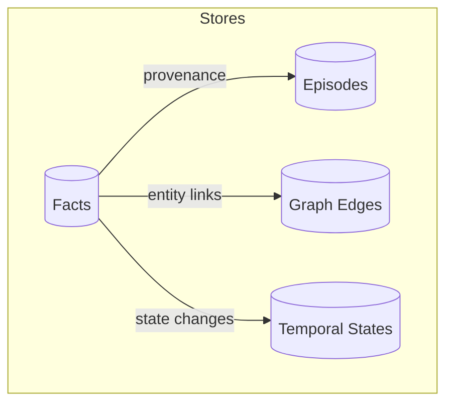
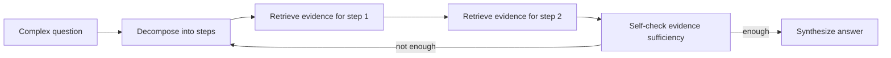

# LLM Memory — “real memory”, not chat history

**LLM Memory** is a local-first memory system for agents that stores *structured facts + provenance + temporal state* and retrieves them with multi-angle search and multi-hop reasoning. It’s built to be inspectable: you can **watch facts and the graph form in the UI** as you chat or as you replay benchmark conversations.

[](https://opensource.org/licenses/MIT)
[](https://www.python.org/downloads/)
[](https://ollama.com/)

---

## Visual tour (UI + architecture)


> Replace these SVGs with real screenshots later (same paths keep the README stable).

---

## What you get

| Capability | What it does | Why it matters |
|---|---|---|
| **LLM-backed fact extraction** | Turns unstructured turns into granular facts (S–P–O + metadata). | Enables grounded answers + graph building. |
| **Conflict resolution** | Detects updates / contradictions and marks stale facts non-current. | Prevents “double beliefs”. |
| **Temporal state tracking** | Models “since/for/ago” and duration questions. | “How long?” becomes computable, not guessed. |
| **Multi-angle retrieval** | Keyword + graph traversal + temporal lookup (and more). | Recall stays high even with phrasing drift. |
| **Multi-hop reasoning** | Decomposes complex questions and iteratively retrieves. | Helps with questions requiring chaining. |
| **Inspectable UI** | Facts, graph, timeline panels update in real time. | Debugging becomes visual instead of vibe-based. |

---

## Quickstart

### 1) Install

**Requirements**
- Python **3.11+**
- [Ollama](https://ollama.com/) running locally

**Setup**

```bash
python -m venv venv
source venv/bin/activate
pip install -r requirements.txt
```

### 2) Run the Web UI (recommended)

```bash
python llm_memory/agents_v4/web_ui.py
```

Open `http://127.0.0.1:5000`.

### 3) Run the CLI agent

```bash
python run_agent.py
```

### 4) Stream LOCOMO conversations into the UI (watch memory form)

1) Start the UI (step 2)
2) In another terminal:

```bash
python run_benchmark_ui.py
```

This will clear memory and replay LOCOMO turns into `/api/chat` so you can watch **Facts/Graph/Timeline** evolve live.

---

## Architecture (Mermaid diagrams)

### End-to-end flow

```mermaid
flowchart LR
  U[User / Conversation Turn] --> N[Normalizer]
  N --> X[Fact Extractor]
  X --> C[Conflict Resolver]
  C --> F[(Fact Store (SQLite))]
  N --> E[(Episodes (raw text))]
  C --> T[(Temporal State)]
  C --> G[(Knowledge Graph)]

  Q[Question] --> R[Retriever]
  R -->|keyword / graph / temporal| F
  R -->|graph traverse| G
  R -->|duration + state| T
  R --> S[Multi-hop Reasoner]
  S --> A[Answer Synthesis]
```

### Data model (what gets stored)



### Multi-hop reasoning loop (high level)



---

## Benchmarks

This repo includes a benchmark suite under `benchmarks/` with a detailed guide:
- `benchmarks/README.md`

### Latest benchmark snapshot (from generated report)

The repo contains benchmark reports like:
- `benchmarks/reports/LLM-Memory (gemma3:27b)_20260121_154816.md`

Key numbers from that report:

| Scenario | Composite | F1 | Contains Match | Exact Match | P95 latency |
|---|---:|---:|---:|---:|---:|
| single_hop | 53.9 | 0.195 | 100.0% | 0.0% | 4798.4ms |
| multi_hop | 39.0 | 0.132 | 100.0% | 0.0% | 8982.2ms |
| temporal | 21.8 | 0.100 | 90.0% | 0.0% | 6247.1ms |
| conflict | 20.1 | 0.075 | 66.7% | 0.0% | 7851.6ms |

Overall composite score (same report): **33.7 / 100**.

### Run the benchmark suite

```bash
python -m benchmarks.benchmark_memory --quick
```

For the full set of options (scenarios, samples, comparisons), see `benchmarks/README.md`.

---

## Model configuration

The UI/CLI currently default to `qwen2.5:32b` in:
- `llm_memory/agents_v4/web_ui.py`
- `run_agent.py`

If you want to switch models, update `model_name="..."` in those files (for example, `openthinker:32b` if you have it in Ollama).

---

## Repo map

```text
llm_memory/
  agents_v4/              # LangGraph agent + Flask UI
  memory_v4/              # V4 memory system (facts/temporal/retrieval/multi-hop)
benchmarks/               # Benchmark suite + LOCOMO data + reports
run_agent.py              # Interactive CLI runner
run_benchmark_ui.py        # Replays LOCOMO into the Web UI
```

---

## Testing

```bash
pytest -q
```

---

## License

MIT — see `LICENSE`.
