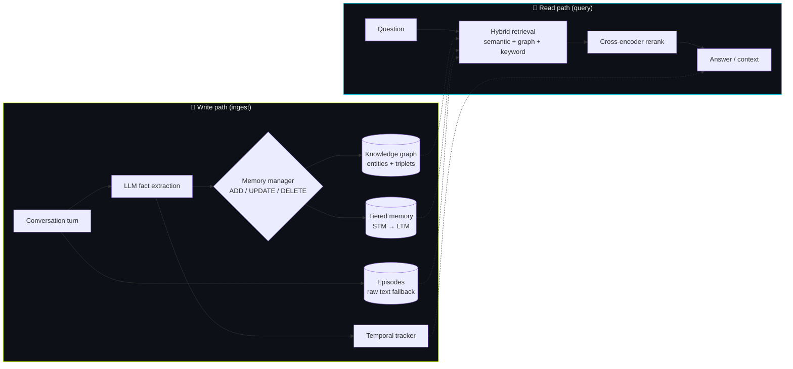
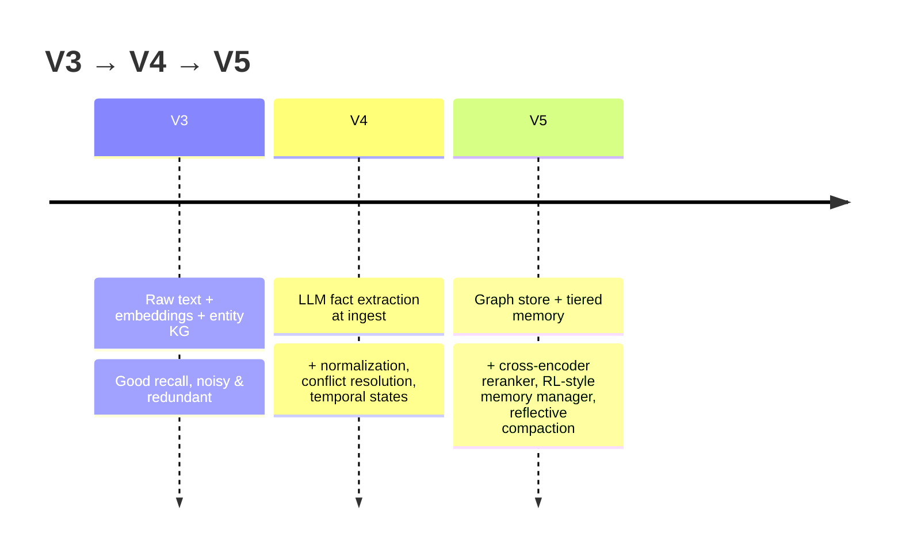

# 🧠 LLM Memory — Architecture Guide

> Every AI forgets you the moment you close the chat. Chat history isn't memory — it's re-reading the whole transcript every time.
>
> **LLM Memory** is a *local-first*, *fact-structured* long-term memory layer for LLM agents. It extracts **structured facts** from conversations at ingest time, tracks **temporal state**, resolves **conflicts**, and retrieves with **multi-angle search + reranking** — running entirely on your machine (Ollama + local sentence-transformers), with an **optional** Claude/OpenAI path.

<p align="center">
  
</p>

---

## The big idea

Most "memory" is just stuffing past messages back into the prompt. LLM Memory instead does the expensive work **once, at write time** — turning messy dialogue into clean, queryable facts — so retrieval is fast, precise, and survives across sessions.



---

## The four generations

This repo is a build-in-public lineage. Each version kept what worked and rethought what didn't.

| | **Original** (`MemorySystem`) | **V3** | **V4** *(reference)* | **V5** *(active)* |
|---|---|---|---|---|
| Idea | 3-tier STM/episodic/semantic store | Raw text + embeddings + KG | **Facts-first** extraction | **Graph + tiered + reranking** |
| Storage | SQLite + vector | in-mem dicts + SQLite | flat fact dicts + episodes | graph + tiered + episodes |
| Extraction | encoding pipeline | rule-based NER | **LLM at ingest** | LLM + rule fallback, RL-style manager |
| Retrieval | intent-aware search | semantic + KG hops + rerank | multi-angle + HyDE + multi-hop | **bi-encoder → cross-encoder rerank + graph beam search** |
| Temporal | — | duration reasoning | temporal-state tracker | temporal-state tracker (graph-aware) |
| Providers | local | Ollama | Ollama **or** Claude | Ollama **or** Claude/OpenAI |

📄 **Deep dives:** [V3](./v3.md) · [V4](./v4.md) · [V5](./v5.md)

---

## How it evolved (and why)



- **V3 → V4:** raw text is noisy. V4 moved the LLM to *write time* to extract structured `(subject, predicate, object)` facts, added a **TextNormalizer** (pronoun/coref resolution) and a **ConflictResolver** (supersede facts over time instead of deleting).
- **V4 → V5:** added a **knowledge graph** (typed entities/relations) for multi-hop reasoning, a **3-tier memory** (Sensory → STM → LTM) to filter noise, a **cross-encoder reranker** for precision, and an **RL-inspired memory manager** (ADD/UPDATE/DELETE/NOOP) to curb redundancy.

---

## Results — and an honest read

Evaluated on **LOCOMO**. The headline finding from a controlled run (conversation `conv-26`, **n≈199 questions**, on `claude-haiku-4-5`):

| Category | V4 F1 | V5 F1 | mem0 ref | V4 ref |
|---|---|---|---|---|
| temporal | 0.449 | **0.436** | 0.300 | 0.228 |
| open-domain | 0.341 | 0.361 | — | — |
| single-hop | 0.173 | 0.175 | 0.420 | 0.434 |
| multi-hop | 0.144 | 0.065 | 0.250 | 0.265 |
| adversarial | 0.005 | 0.015 | — | — |
| **Overall** | **0.242** | **0.244** | — | — |

**What's actually true (no spin):**
- 🟢 **Temporal reasoning beats the mem0 baseline** (0.44 vs 0.30) — the temporal-state tracker is the system's real strength.
- 🟡 **V5 ≈ V4 on accuracy** — the V5 rewrite mostly bought **~2.5× speed** (9 min vs 23 min for the same run), not higher scores.
- 🔴 **The bottleneck is the retrieval pipeline, not the model.** Two very different architectures fail almost identically on single-hop and adversarial questions — so a bigger/better LLM doesn't move these.
- ⚠️ These numbers are **one conversation (n≈199)** on a small cloud model — directional, not a leaderboard claim. A full 10-conversation sweep is the next step.

> See [`benchmarks/`](../../benchmarks/) to reproduce. Local runs use Ollama; set `LLM_MEMORY_MODEL` + `ANTHROPIC_API_KEY` to run on Claude.

---

## Repo map

```
llm_memory/
├── memory_v3/     # V3: raw text + embeddings + knowledge graph
├── memory_v4/     # V4: facts-first extraction (reference)
├── memory_v5/     # V5: graph + tiered memory + reranking (active)
├── agents_v4/ agents_v5/   # LangGraph agents + web UIs
├── api/ models/ storage/ retrieval/   # original MemorySystem (v1/v2)
└── conflict/ consolidation/ decay/ encoding/
benchmarks/        # LOCOMO + LongMemEval harnesses
docs/architecture/ # you are here
```
