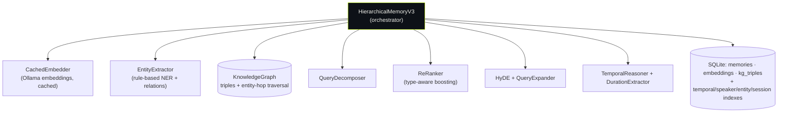
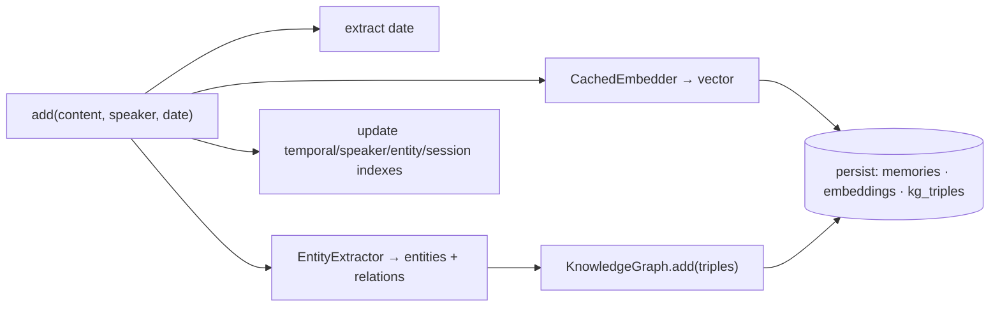
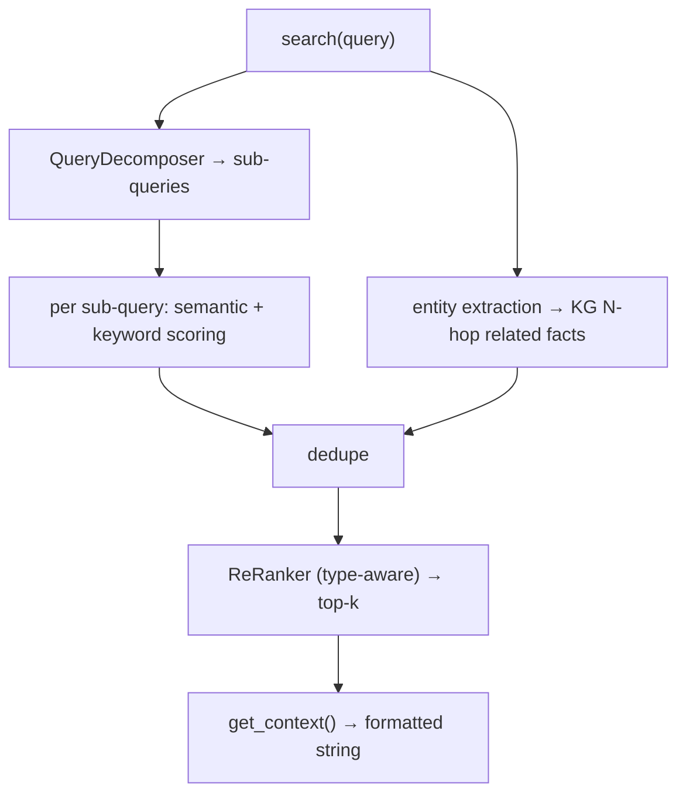

# V3 — Raw Text + Embeddings + Knowledge Graph

The first "real" memory iteration: store conversation text, index it with embeddings, and layer a rule-based **entity knowledge graph** for multi-hop lookups. Still exported as the public `create_memory_v3` API.

📁 `llm_memory/memory_v3/` · benchmark: `benchmarks/locomo_v3.py`

---

## Components



| Module | Class | Responsibility |
|---|---|---|
| `memory_v3.py` | `HierarchicalMemoryV3`, `MemoryItemV3` | Orchestrator + in-memory dicts + SQLite |
| `entity_extractor.py` | `EntityExtractor` | Rule-based NER (person/date/location/…) + relation triples |
| `knowledge_graph.py` | `KnowledgeGraph`, `KGTriple` | Triple store with subject/object/predicate indexes + N-hop |
| `embedder.py` | `CachedEmbedder` | Cached Ollama embeddings + cosine similarity |
| `query_decomposer.py` | `QueryDecomposer` | Split complex queries into sub-queries |
| `reranker.py` | `ReRanker` | Query-type-aware re-scoring |
| `hyde.py` | `HyDEGenerator`, `QueryExpander` | Hypothetical-doc + synonym expansion |
| `temporal_reasoning.py` | `TemporalReasoner`, `DurationExtractor` | Date parsing + duration answers |
| `evidence_chain.py` | `MultiHopReasoner`, `ReasoningChain` | Multi-hop reasoning with evidence tracking |

---

## Ingest



## Query



---

## Key design choices

- **Dual storage:** in-memory dicts (speed) + SQLite (persistence).
- **Multi-index:** temporal / speaker / entity / session inverted indexes for O(1) lookup.
- **Knowledge graph as *secondary* retrieval** — entity hops surface related facts the embedding search misses.
- **Embedding cache** avoids recomputing vectors.
- **Specialized temporal logic** distinguishes "when" vs "how long" questions.

> **Why V4 replaced it:** raw-text storage is noisy and redundant. V4 moved extraction to ingest time so memory holds clean, deduplicated facts rather than transcripts. See [v4.md](./v4.md).

## Entry points

```python
from llm_memory.memory_v3 import create_memory_v3

mem = create_memory_v3(user_id="alice")
mem.add("Alice loves hiking in the mountains", speaker="Alice")
results = mem.search("What does Alice enjoy?")
context = mem.get_context("Tell me about Alice")
```
