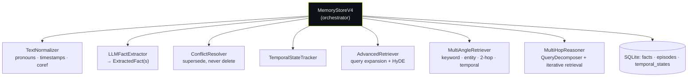
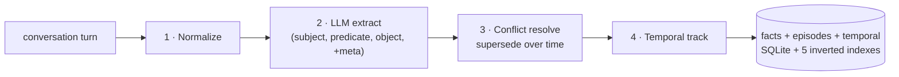
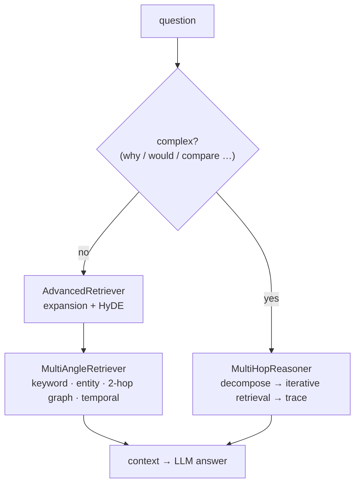

# V4 — Facts-First Memory *(reference)*

The reference implementation and the conceptual heart of the project: **extract structured facts at ingest time** instead of storing raw text. Kept stable as the baseline V5 is measured against.

📁 `llm_memory/memory_v4/` · `llm_memory/agents_v4/` · benchmark: `benchmarks/locomo_v4.py`

---

## Components



| Module | Class | Responsibility |
|---|---|---|
| `memory_store.py` | `MemoryStoreV4`, `Episode` | Orchestrator + raw-context provenance |
| `normalizer.py` | `TextNormalizer` | Resolve `I`→speaker, clean timestamps, standardize terms |
| `llm_extractor.py` | `LLMFactExtractor`, `ExtractedFact` | LLM fact extraction (Ollama **or** Claude) + rule fallback |
| `conflict_resolver.py` | `ConflictResolver` | Detect duplicate/contradiction/update; mark `superseded_by` |
| `temporal_state.py` | `TemporalStateTracker`, `TemporalState` | Parse durations, answer "how long…" |
| `retrieval.py` | `MultiAngleRetriever` | keyword + entity-overlap + 2-hop graph + temporal search |
| `advanced_retrieval.py` | `AdvancedRetriever` | query expansion (×3) + HyDE |
| `multi_hop.py` | `QueryDecomposer`, `MultiHopReasoner` | decompose → iterate → trace reasoning |
| `agents_v4/` | `MemoryAgent`, tools, Flask `web_ui` | LangGraph agent + chat UI |

---

## Ingest — a 4-phase pipeline



`ExtractedFact` = `(type, subject, predicate, object, confidence, temporal_scope, provenance, is_current, superseded_by)`. Facts are **never deleted** — superseded facts stay for change-over-time reasoning.

## Query



---

## Key design choices

- **Facts as flat dicts**, not a graph — simpler indexing & conflict handling (this is the main contrast with V5's graph).
- **Semantic search via entity overlap** (no embeddings in core V4) — fast, but the weaker spot vs V5.
- **Conflict = supersede, not delete** — preserves history.
- **Multi-provider:** model name containing `claude` → `ChatAnthropic`; else `ChatOllama`. Wired into `llm_extractor`, `advanced_retrieval`, `multi_hop`.

## Entry points

```python
from llm_memory.memory_v4.memory_store import create_memory_v4

mem = create_memory_v4(user_id="alice", model_name="qwen2.5:7b")  # or claude-haiku-4-5
mem.add_conversation_turn(speaker="Alice", text="I love hiking and pottery", date="2023-05-07")
ctx = mem.build_context_for_question("What does Alice enjoy?")
```
