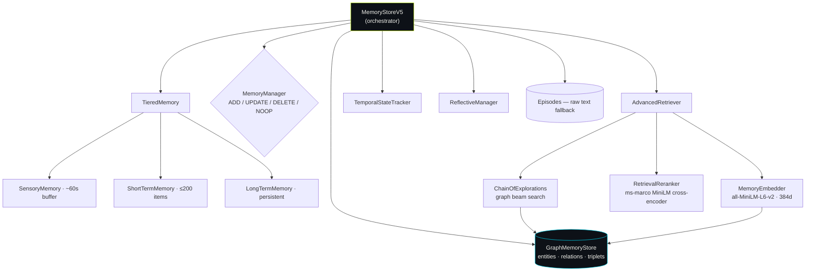
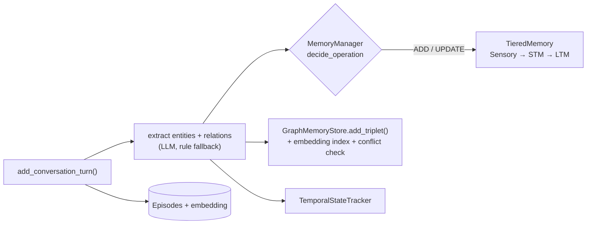
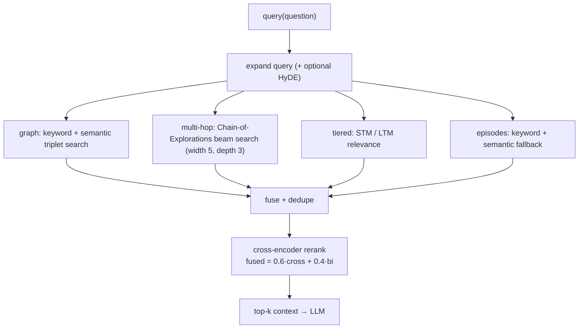

# V5 — Graph + Tiered Memory + Reranking *(active)*

The current primary stack. Synthesizes ideas from Mem0g (graph), tiered/Atkinson-Shiffrin memory, Memory-R1 (learned manager), Chain-of-Explorations (graph retrieval) and reflective memory management — all local-first.

📁 `llm_memory/memory_v5/` · `llm_memory/agents_v5/` · benchmark: `benchmarks/locomo_v5.py`

---

## Components



| Module | Class | Responsibility |
|---|---|---|
| `memory_store_v5.py` | `MemoryStoreV5` | Orchestrator: ingest, query, answer; owns every component below |
| `graph_store.py` | `GraphMemoryStore`, `Entity`, `Relation`, `Triplet` | Typed knowledge graph with per-triplet embeddings + semantic search |
| `tiered_memory.py` | `TieredMemory`, `SensoryMemory`, `ShortTermMemory`, `LongTermMemory` | Sensory → STM → LTM flow with importance-based promotion + decay |
| `memory_manager.py` | `MemoryManager` | RL-inspired ADD/UPDATE/DELETE/NOOP policy; similarity + contradiction checks |
| `retrieval_v5.py` | `AdvancedRetriever`, `ChainOfExplorations` | Hybrid retrieval: keyword + semantic + graph beam search + fusion + rerank |
| `embedder.py` | `MemoryEmbedder`, `RetrievalReranker` | Local bi-encoder (retrieve) + cross-encoder (rerank); singletons, no API key |
| `temporal_v5.py` | `TemporalStateTracker` | Duration / "how long ago" answering from tracked states |
| `reflective.py` | `ReflectiveManager` | Prospective (summarize) + retrospective (feedback) reflection |
| `agents_v5/` | `MemoryAgentV5` | LangGraph agent with `ask_memory` / `save_memory` / `query_graph` tools |

---

## Ingest flow



Importance ≥ **0.4** promotes STM → LTM (also at session boundaries / on overflow). The graph stores `(subject, predicate, object)` triplets with typed entities and exclusive-relation conflict detection (e.g. `LIVES_IN`, `WORKS_AT`).

## Query flow



<p align="center"></p>

---

## Key design choices

- **Local embeddings:** `sentence-transformers/all-MiniLM-L6-v2` (384-dim, ~23 MB, CPU) — no API, no cost.
- **Two-stage retrieval:** fast bi-encoder recall → cross-encoder (`ms-marco-MiniLM-L6-v2`) precision rerank.
- **Graph augments, never replaces:** flat semantic search stays primary; the graph adds multi-hop reach.
- **Tiered memory** filters noise before it reaches long-term store (human-memory inspired).
- **Memory manager** decides ADD/UPDATE/DELETE/NOOP (similarity threshold 0.8) to curb redundancy.
- **Episodes** keep raw text as a safety net when extraction/graph miss something.

## Entry points

```python
from llm_memory.memory_v5 import create_memory_v5

mem = create_memory_v5(user_id="alice", persist_path="./alice_mem",
                       model_name="qwen2.5:7b", use_llm=True)   # or claude-haiku-4-5

mem.add_conversation_turn(speaker="Alice", text="I moved from Sweden 4 years ago",
                          date="2023-05-07", session_id="s1")
ctx    = mem.query("Where is Alice from?")             # hybrid retrieval → context
answer = mem.answer_question("How long since Alice left Sweden?")  # temporal
```
